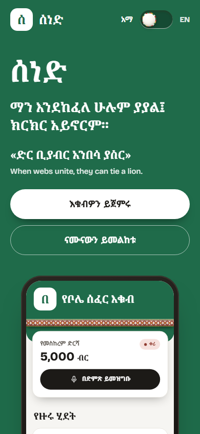
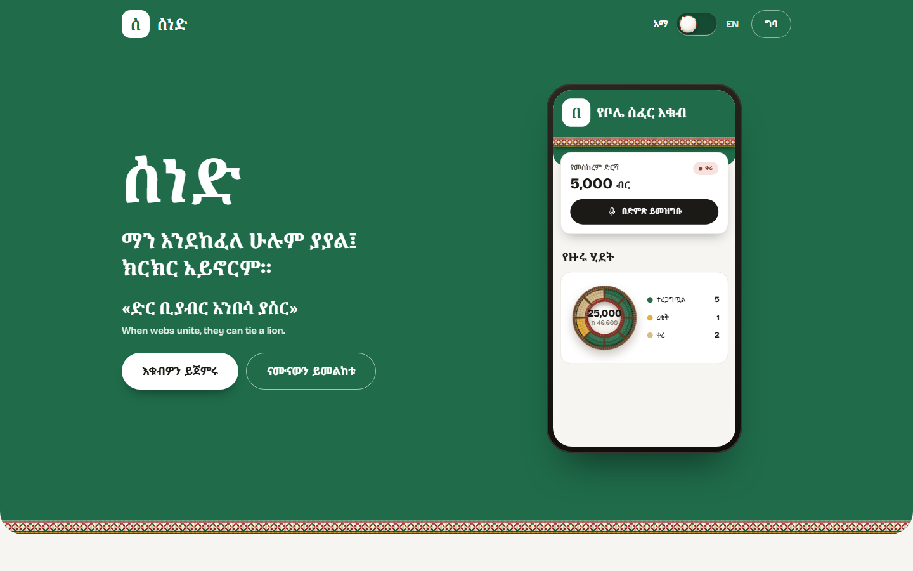
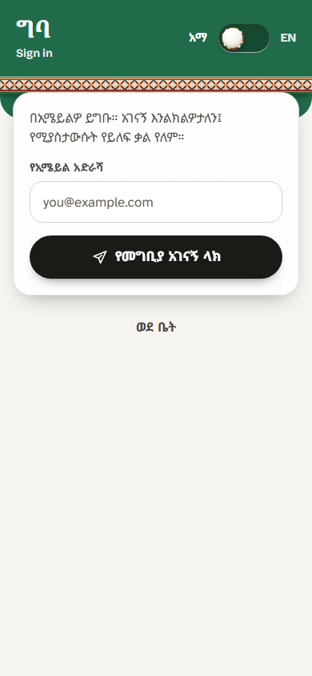
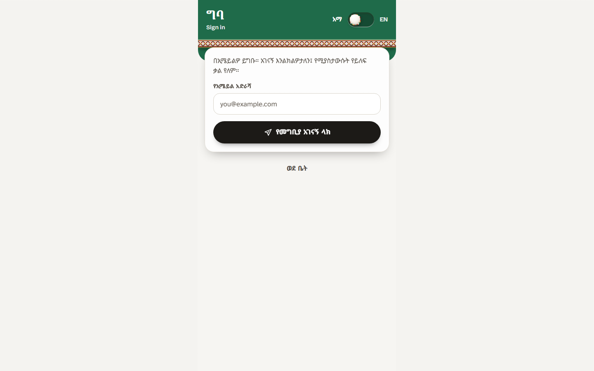
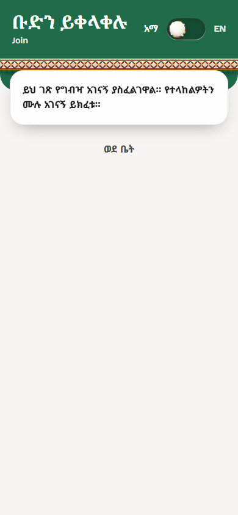
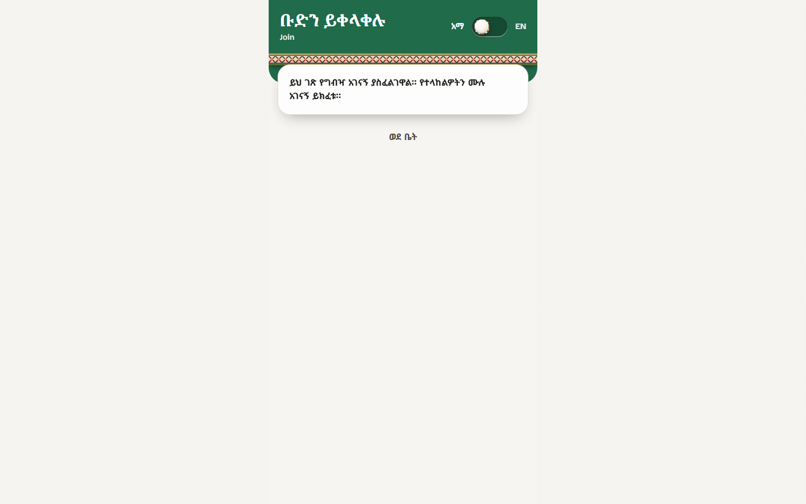

# Sened (ሰነድ)

> A community ledger for Ethiopian equbs and iddirs: everyone sees who paid, and nobody has to argue about it.
> Built by **Team GitGud** for the **STARK Official Hackathon 2026**.

[](https://www.scholarxiv.com/collections/6aaf5269f7a1121dbd049897?token=293b33f942e29f15a7bc9b4fd82b33bf88eb252a190ebbdb05c5ded00cf36896)
[](https://voxide.app)
[](https://links.et)
[](https://sened.ethiodeploy.com)

Live: https://sened.ethiodeploy.com

## What it is

Equbs (ዕቁብ, rotating savings) and iddirs (ዕድር, mutual aid) move large sums of Birr on trust. Payments now arrive as mobile-money screenshots in chat groups, and records live in one treasurer's notebook or head. Sened is a phone-first progressive web app that keeps a tamper-evident ledger for the group, lets members speak a payment in Amharic or English instead of typing, checks bank receipts against the issuing bank, and runs the winner draw in a way every member can verify on their own phone. The interface is bilingual (Amharic and English) and designed around the ሰነድ, the equb ledger, stamps and the gathering around the mesob.

## Features

- **Landing page at `/`** for signed-out visitors (with an Amharic/English switch); signed-in members land on their Home. `/welcome` still serves the same landing page.
- **Home (`/home`, and `/` when signed in):** the group's round, contribution progress in a basket ring, recent ledger activity. Signed out, it shows clearly labelled sample data.
- **Ledger (`/ledger`):** append-only, double-entry, SHA-256 hash-chained entries in Postgres. Balance and immutability are enforced in the database; corrections are reversals. Payer attribution, payment channel and a note can be recorded for cash contributions, and are never shown as bank-verified.
- **Draw (`/draw`, `/draw/manage`):** a commit-reveal lottery (members commit seeds, then reveal), an independent verifier, reserve retention, collateral and guarantor tracking, a contribution gate, and a 3D mesob ceremony (Three.js). Signed out, the same engine runs on-device with labelled demo data.
- **Chat (`/chat`, `/chat/[groupId]`):** group channels with messages, reactions and RSVPs saved in Supabase, live updates through Supabase Realtime, and an offline send queue.
- **Profiles and communities (`/account`, `/account/edit`, `/community/new`, `/members`):** profiles and communities are stored on the server; managers create invite links, and `/join` redeems them end to end (single-use, expiring and revocable).
- **Voice (`/voice`, `/voice/draft`):** a mic dock that logs a contribution from speech. The parser reads Amharic and Afaan Oromoo numerals, Ethiopian month names, providers and references. Speech is always provisional and needs a confirmation. Amharic server transcription and spoken digests use Addis AI; the English voice assistant is the Voxide widget; browsers with on-device speech recognition work without any key.
- **Receipt verification:** a signed-in treasurer's entry is sent to `/api/bank-verifications`, which checks it against Telebirr, CBE or Awash through Links.et. With no key nothing is ever marked verified; unresolved receipts are queued and drained by `/api/reconciliation/drain`.
- **Governance copilot (`/governance`):** advisory bylaw and penalty recommendations with citation chips from a bundled catalogue; an optional ScholarXIV key lets the server confirm the cited papers.
- **Offline and PWA (`/offline`):** installable, a service worker with per-build caches, an IndexedDB (Dexie) roster, notes and draft entries with an outbox that syncs through `POST /api/sync` when signed in.
- **Amharic and English, Ethiopian calendar:** every visible string is in a typed i18n table; dates use a tested Ethiopian (Ge'ez) calendar conversion, including Pagume leap years.

External providers (Links.et, Addis AI, ScholarXIV, Voxide) are optional and inert until their keys are set; none of them ever fabricates a result.

## Tech stack

Next.js 14 (App Router, standalone output) · React 18 · TypeScript · Tailwind CSS · Supabase (Postgres, Auth, Realtime, RLS) · Zod · Dexie · Three.js · `@voxide/react` · Vitest + Testing Library · Playwright · Docker.

## Local setup

Requires Node 22.

```bash
npm install
cp .env.example .env.local   # fill in what you need
npm run dev                  # http://localhost:3000
```

Without any keys the app runs: signed-out screens show labelled sample data and `/api/*` answers `503 not_configured`.

Environment variable names (see `.env.example` for what each does; set values only in `.env.local` or the host, never in git):

| Group | Names |
| --- | --- |
| Supabase (browser, build time) | `NEXT_PUBLIC_SUPABASE_URL`, `NEXT_PUBLIC_SUPABASE_ANON_KEY` |
| Bank reference protection | `BANK_REFERENCE_ENCRYPTION_KEY`, `BANK_REFERENCE_HMAC_KEY`, `BANK_REFERENCE_KEY_VERSION` |
| Links.et | `LINKS_ET_API_KEY`, `LINKS_ET_BASE_URL`, `LINKS_ET_WAIT_MS`, `LINKS_ET_TIMEOUT_MS`, `LINKS_ET_ETB_OFFSET_MINUTES`, `LINKS_ET_TIMESTAMP_TOLERANCE_SECONDS` |
| Reconciliation drain | `RECONCILIATION_CRON_SECRET`, `SUPABASE_SERVICE_ROLE_KEY`, `RECONCILIATION_DRAIN_MAX_JOBS`, `RECONCILIATION_DRAIN_BUDGET_MS` |
| ScholarXIV | `SCHOLARXIV_API_URL`, `SCHOLARXIV_API_KEY`, `SCHOLARXIV_TIMEOUT_MS` |
| Addis AI (Amharic voice) | `ADDIS_AI_API_KEY`, `ADDIS_AI_TTS_VOICE`, `VOICE_STT_PROVIDER`, `VOICE_TTS_PROVIDER` |
| Voxide (browser, build time) | `NEXT_PUBLIC_VOXIDE_KEY` |
| Site | `NEXT_PUBLIC_SITE_URL` |

`NEXT_PUBLIC_*` values are inlined at build time, so changing one needs a rebuild.

## Database migrations

All schema lives in `supabase/migrations/`, applied in filename order.

```bash
npx supabase link --project-ref <ref>
npx supabase db push --db-url "postgresql://postgres.<ref>:<password>@aws-0-<region>.pooler.supabase.com:5432/postgres"
```

Use the **IPv4 session pooler** URL (Supabase dashboard, Connect). The direct host `db.<ref>.supabase.co` is IPv6-only and fails from most IPv4 networks and CI runners. Never commit the database password. See [`docs/DEPLOYMENT.md`](./docs/DEPLOYMENT.md).

## Testing

```bash
npm test            # Vitest unit and component tests
npm run typecheck   # tsc --noEmit
npm run lint
npm run test:e2e    # Playwright, mobile and desktop projects (needs a production build)
npm run test:all    # lint, typecheck, unit tests, build, e2e
powershell -ExecutionPolicy Bypass -File scripts\verify-migrations.ps1
```

`scripts/verify-migrations.ps1` starts a throwaway Postgres container (Docker required), applies every migration in order, and runs the SQL verification scripts. It never touches a real Supabase project.

## Deploy

Hosted on **EthioDeploy** as a container: the `Dockerfile` builds the standalone Next server (port 3000, health check on `GET /`). Pass the two `NEXT_PUBLIC_SUPABASE_*` values (and `NEXT_PUBLIC_VOXIDE_KEY`) as build args, set the runtime secrets in the host configuration, and add the public URL to Supabase's allowed redirect URLs and to the Voxide dashboard's domain whitelist. Step by step: [`docs/hackathon/deploy-checklist.md`](./docs/hackathon/deploy-checklist.md) and [`docs/DEPLOYMENT.md`](./docs/DEPLOYMENT.md).

## Screenshots

Public pages, captured from the running app (phone 390x844, desktop 1440x900).

| Page | Phone | Desktop |
| --- | --- | --- |
| Landing (`/`) |  |  |
| Sign in (`/sign-in`) |  |  |
| Join (`/join`) |  |  |

## Research and ideation

- [ScholarXIV ideation write-up](./docs/hackathon/scholarxiv-ideation.md)
- [Ideation journal](./docs/IDEATION.md) and [roadmap](./ROADMAP.md)
- [ScholarXIV collection](https://www.scholarxiv.com/collections/6aaf5269f7a1121dbd049897?token=293b33f942e29f15a7bc9b4fd82b33bf88eb252a190ebbdb05c5ded00cf36896)

## Team GitGud

Track: Software / Product Development. STARK Official Hackathon 2026. Built from scratch during the event and tracked through atomic Git commits.

## License

MIT. Copyright (c) 2026 Team GitGud.
