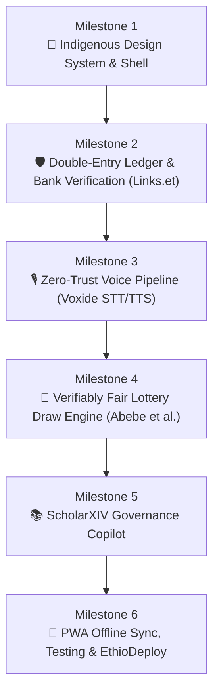

# Sened (ሰነድ) — Product & Technical Roadmap
> **Voice-Audited Community Treasury & Dispute-Free Trust Engine for Ethiopian Equbs and Iddirs.**  
> Built by **Team GitGud** for the **STARK Official Hackathon 2026**.

---

## 🏛️ Vision & Design Reference
*Sened* is designed to bridge the gap between traditional Ethiopian community finance (*Equb* and *Iddir*) and modern digital banking. The interface directly mirrors the generated cultural design reference:

### Core UI Pillars:
1. **Indigenous Cultural Design Tokens**: Warm Ethiopian coffee obsidian (`#1A1412`), aged parchment cream (`#F5EFEB`), Lalibela terracotta (`#C6532B`), antique gold (`#D4A244`), and traditional *Tibeb* (ጥበብ) geometric embroidery accents.
2. **Digital *ደብተር* (Debter Card)**: Leather-stitched tactile card replacing the paper ledger, displaying total pot balance, cycle progress, and the next *እጣ* (draw).
3. **The Woven *መሶብ* (Mesob Draw Icon)**: Symbolic pot visualization for the verifiably fair lottery draw.
4. **Instant Bank Verification Badges**: Real-time Telebirr and CBE Birr transaction badges powered by Links.et.
5. **One-Touch Spoken Audio Digest (*አድምጥ*)**: Single tap audio balance sheet reading out treasury status in natural Amharic for elder treasurers.
6. **Spoken Voice Logging Dock**: Glowing terracotta-and-gold microphone button for vernacular voice contribution logging.

---

## 🗺️ Milestone Roadmap

---

### Milestone 1: Indigenous Design System & Core Shell
**Target:** Establish the complete cultural component foundation and responsive mobile-first shell matching the visual reference.

- [ ] **1.1 Design System & Typography**:
  - Configure fonts: Noto Sans Ethiopic / Abyssinica SIL for Ge'ez script alongside Inter for numerals.
  - Implement color tokens: Coffee Dark (`#1A1412`), Parchment Cream (`#F5EFEB`), Terracotta (`#C6532B`), Antique Gold (`#D4A244`), and Bank Verification Green (`#16A34A`).
  - Create reusable SVG assets for traditional *Tibeb* (ጥበብ) diamond and cross geometric borders.
- [ ] **1.2 Digital *ደብተር* (Debter) Card Component**:
  - Leather-textured card styling with subtle stitching border and *Tibeb* corner ribbon.
  - Live pot balance display (`175,000 ብር`), cycle progress indicator (`17/20 Contributed`), and upcoming draw summary.
- [ ] **1.3 Verified Contribution Feed**:
  - Member cards with avatars, traditional attire styling (*Gabi* / *Netela* accents), and contribution amount (`+5,000 ETB`).
  - Dynamic verification badges: `Telebirr Verified` and `CBE Birr Verified` with transaction reference numbers.
- [ ] **1.4 Bottom Navigation & Voice Dock**:
  - Floating tactile navigation bar with Home, Ledger (*ደብተር*), Members, and Profile slots.
  - Prominent elevated central terracotta/gold microphone trigger.

---

### Milestone 2: Double-Entry Ledger Engine & Real-Time Bank Verification (Links.et)
**Target:** Implement the tamper-proof financial core and automated receipt verification to eliminate fake screenshots.

- [ ] **2.1 Immutable Double-Entry Ledger**:
  - Append-only journal architecture with SHA-256 hash chaining (`previous_hash`, `entry_hash`, `timestamp`, `nonce`).
  - Zero-in-place updates: corrections require compensating balancing entries with explicit audit rationales.
  - Mathematical integrity checks: $\sum \text{Debits} = \sum \text{Credits}$ enforced at database commit level.
- [ ] **2.2 Links.et / Ethiopian Bank Gateway Integration**:
  - Verification adapter for Telebirr, Commercial Bank of Ethiopia (CBE), and Awash Bank.
  - Real-time reference validation endpoint: verifies amount, sender/receiver, and timestamp within 800ms.
- [ ] **2.3 Graceful Degradation & Reconciliation Queue**:
  - Offline / network outage fallback: transactions marked `PENDING_RECONCILIATION`.
  - Exponential backoff queue that automatically checks bank status when connectivity returns.

---

### Milestone 3: Zero-Trust Voice Pipeline (Voxide STT & TTS)
**Target:** Enable seamless Amharic and Afaan Oromoo spoken contribution logging and spoken audio financial balance sheets.

- [ ] **3.1 Spoken Contribution Logging (Voxide STT)**:
  - Web Audio API microphone recorder with real-time waveform visualizer inside the bottom microphone dock.
  - Entity extraction parser for Ethiopian monetary phrasing:
    - *"ለመስከረም ወር እቁብ 5,000 ብር በቴሌብር አስገብቻለሁ፣ ቁጥሩ 9BF42 ነው"* $\rightarrow$ `{ month: "Meskerem", amount: 5000, channel: "telebirr", tx_ref: "9BF42" }`.
  - **Zero-Trust Rule**: Voice extracted data is strictly provisional until Milestone 2 Links.et verification succeeds.
- [ ] **3.2 Spoken Audio Balance Sheet (*አድምጥ* - Listen via Voxide TTS)**:
  - Top *አድምጥ* button synthesizes an Amharic audio digest of the current Equb/Iddir treasury status:
    - *"የቦሌ መድኃኔዓለም እቁብ ዛሬ 17 አባላት አስገብተዋል። ጠቅላላ ሒሳብ 175,000 ብር ነው። 3 አባላት ይቀራሉ። ቀጣይ እጣ እሁድ ይወጣል።"*
  - Native browser audio playback with play, pause, and speed controls.

---

### Milestone 4: Verifiably Fair Lottery Draw Engine (*እጣ*)
**Target:** Implement a transparent, mathematically fair pot allocation system based on Dr. Rediet Abebe et al. (AAAI 2022) ROSCA mechanism design.

- [ ] **4.1 Cryptographically Fair Random Draw**:
  - Commit-reveal lottery mechanism using SHA-256 block hashes to prevent treasurer bias or favoritism.
  - Visual ceremonial *Mesob* (መሶብ) draw animation with celebratory tactile feedback.
- [ ] **4.2 Rotation & Default Risk Management (Abebe et al.)**:
  - Tracking payout history: previous winners are excluded from remaining draws in the cycle.
  - Dynamic social collateral & reserve retention model to minimize post-win contribution defaults.

---

### Milestone 5: ScholarXIV Governance Copilot
**Target:** An in-app governance advisor querying the ScholarXIV Papers API to ground community bylaws and penalty rules in peer-reviewed economic research.

- [ ] **5.1 ScholarXIV Papers API Adapter**:
  - Connect to live ScholarXIV collection (`6aaf5269f7a1121dbd049897`) and query preprints (Abebe et al., Fan Wang, Sowon et al., Dercon et al.).
- [ ] **5.2 Bylaw & Penalty Recommendation Engine**:
  - Interactive copilot dialog for treasurers configuring late payment penalties, replacement member protocols, and emergency medical fund allocations for Iddirs.
  - Citation tags linking bylaws directly to academic literature on ROSCA equilibrium.

---

### Milestone 6: PWA Offline Sync, Reliability Testing & EthioDeploy
**Target:** Deliver a production-grade, offline-first Progressive Web App hosted live on EthioDeploy.

- [ ] **6.1 Offline-First Architecture (IndexedDB / Dexie.js)**:
  - Full local persistence: treasurers can view rosters, record spoken notes, and draft ledger entries during Sunday meetings without active internet.
  - Automatic bidirectional sync when network connectivity is detected.
- [ ] **6.2 Comprehensive Test Suite**:
  - Unit tests for double-entry ledger calculations and hash verification.
  - Voice entity extraction benchmark tests for Amharic and Afaan Oromoo number formats.
  - Automated Playwright browser tests covering both desktop and mobile viewports.
- [ ] **6.3 Deployment & Hackathon Submission**:
  - Docker containerization and live deployment on EthioDeploy.
  - STARK hackathon changelog logging and documentation finalization.

---

## 📊 Summary of Tech Stack

| Layer | Technology |
|---|---|
| **Framework & UI** | Next.js 14 / React 18, Tailwind CSS, Lucide Icons, Ge'ez Web Fonts |
| **Voice & Speech** | Voxide STT (Amharic / Afaan Oromoo), Voxide TTS, Web Audio API |
| **Bank Verification** | Links.et / v.odit.et Verification API (Telebirr & 17 Ethiopian Banks) |
| **Ledger & Math** | Immutable SHA-256 Double-Entry Ledger, Abebe et al. Fair Draw Engine |
| **Academic Grounding**| ScholarXIV API (`sxv_...`) & Live Collection |
| **Offline & Storage** | Dexie.js (IndexedDB), Service Worker PWA |
| **Hosting & Deploy** | EthioDeploy (Live Hosting), GitHub / STARK Verification |
