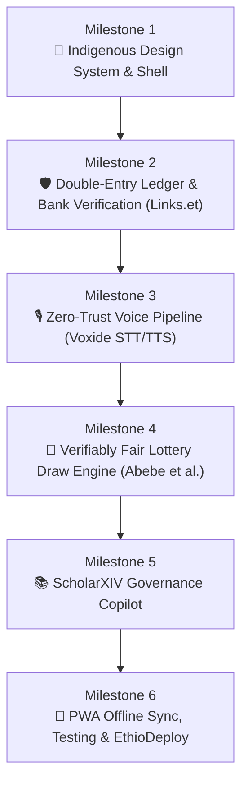

# Sened (ሰነድ) — Product & Technical Roadmap
> **Voice-Audited Community Treasury & Dispute-Free Trust Engine for Ethiopian Equbs and Iddirs.**  
> Built by **Team GitGud** for the **STARK Official Hackathon 2026**.

---

## 🏛️ Vision & Design Reference
*Sened* is designed to bridge the gap between traditional Ethiopian community finance (*Equb* and *Iddir*) and modern digital banking. The interface directly mirrors the generated cultural design reference. (The original reference image was a local file that is not in the repository, so it is no longer linked; the cropped pieces the UI is built from live in `public/reference_assets/`.)

### Core UI Pillars:
1. **Indigenous Cultural Design Tokens**: Warm Ethiopian coffee obsidian (`#1A1412`), aged parchment cream (`#F5EFEB`), Lalibela terracotta (`#C6532B`), antique gold (`#D4A244`), and traditional *Tibeb* (ጥበብ) geometric embroidery accents.
2. **Digital *ደብተር* (Debter Card)**: Leather-stitched tactile card replacing the paper ledger, displaying total pot balance, cycle progress, and the next *እጣ* (draw).
3. **The Woven *መሶብ* (Mesob Draw Icon)**: Symbolic pot visualization for the verifiably fair lottery draw.
4. **Instant Bank Verification Badges**: Real-time Telebirr and CBE Birr transaction badges powered by Links.et.
5. **One-Touch Spoken Audio Digest (*አድምጥ*)**: Single tap audio balance sheet reading out treasury status in natural Amharic for elder treasurers.
6. **Spoken Voice Logging Dock**: Glowing terracotta-and-gold microphone button for vernacular voice contribution logging.

---

## 🗺️ Milestone Roadmap

---

### Milestone 1: Indigenous Design System & Core Shell
**Target:** Establish the complete cultural component foundation and responsive mobile-first shell matching the visual reference.

- [x] **1.1 Design System & Typography**:
  - Configure fonts: Noto Sans Ethiopic / Abyssinica SIL for Ge'ez script alongside Inter for numerals.
  - Note: the Latin/numeral face actually loaded is Plus Jakarta Sans (`src/app/layout.tsx`, `src/app/globals.css`), not Inter; Abyssinica SIL is a fallback in the font stack, not loaded from the web.
  - Implement color tokens: Coffee Dark (`#1A1412`), Parchment Cream (`#F5EFEB`), Terracotta (`#C6532B`), Antique Gold (`#D4A244`), and Bank Verification Green (`#16A34A`).
  - Create reusable SVG assets for traditional *Tibeb* (ጥበብ) diamond and cross geometric borders.
- [x] **1.2 Digital *ደብተር* (Debter) Card Component**:
  - Leather-textured card styling with subtle stitching border and *Tibeb* corner ribbon.
  - Live pot balance display (`175,000 ብር`), cycle progress indicator (`17/20 Contributed`), and upcoming draw summary.
  - Note: signed in, the pot balance and digest are read from the real ledger (`src/lib/ledger/useHomeLedger.ts`). The balance is the server's own figure for the whole ledger (`GET /api/ledger/balances`, backed by `get_ledger_balances_v1`: every posting summed in one database snapshot, so it exists for a group of any size), and the contribution list is the most recent 100 entries, read up to the balance's chain head so the two never disagree; a note says when the list is shorter than the ledger. `GET /api/ledger/entries` pages back through older history with a `beforeSequence` cursor (`{ entries, hasMore, nextCursor }`), and `/draw` cycle figures use it. Signed out, `175,000 ብር` and `17/20` are labelled sample figures.
- [x] **1.3 Verified Contribution Feed**:
  - Status: a ledger contribution that was posted from a verified bank receipt renders as verified on the home screen: the read path (`GET /api/ledger/entries`, `get_ledger_entry_provenance_v1`) returns its provenance, the feed supplies the real provider and verification time to `ContributionFeed`'s unchanged `isVerified` rule, and it names the member who paid (their email only if the members API already shows it to the viewer, otherwise "Member xxxxxxxx"). Every other ledger row stays "Recorded in ledger", and signed out the two sample rows stay labelled.
  - Member cards with avatars, traditional attire styling (*Gabi* / *Netela* accents), and contribution amount (`+5,000 ETB`).
  - Note (attire): each member row's avatar sits in a *Tibeb* embroidered border (`src/components/cultural/MemberAvatar.tsx`), one of four frames (diamond, Meskel cross, zigzag, checker) chosen deterministically from the member id (`src/lib/memberAvatarStyle.ts`). It never looks at a name and never guesses gender. The *Gabi* (white cotton shawl, lower left) and *Netela* (lighter shawl with a woven border, lower right) accents are the member's own choice: `none | gabi | netela`, default `none`, stored per user per group in `ledger_group_memberships.attire` (migration `20261009100000_member_attire.sql`). A member sets only their own value (`PUT /api/ledger/member-attire`, body `{ groupId, attire }`, strict; the SQL function `sened_ledger_set_member_attire_v1` has no user argument and uses `auth.uid()`), from the **Profile** slot, which is a real panel when signed in (radio group, English and Amharic, live preview, saving status); signed out or unconfigured it stays the honest placeholder. Group members read each other's value through the existing members read (`list_group_members_v1` / `GET /api/ledger/members`, field `attire`; it is a display preference, not sensitive) and the home feed draws each verified payer's chosen shawl; a payer the members read did not return gets none. The profile panel learns its own value and id from `GET /api/my-groups` (same RPC, two added keys). The choice is per group: the panel shows and saves the attire of the app's active group (see *Active group* below), and with several groups and none chosen it asks rather than guessing (same rule as every other signed-in surface). Frame and shawl differ by shape, not colour alone; the SVG is decorative (`aria-hidden`) and the name is carried by the photo's alt text or a labelled image role that includes the chosen shawl; colours are the existing `coffee`/`parchment`/`terracotta`/`gold` tokens. The feed sits on a light parchment surface in every theme (the app has no dark-mode switch for it), so there is no second palette. Not yet exercised against a live Supabase project; covered by route and component tests and the SQL harness.
  - Note (active group): a user may belong to several groups, and every signed-in surface follows one app-wide **active group** (`src/lib/groups/activeGroup.ts` store, `useActiveGroup` / `ActiveGroupProvider` mounted in `src/app/layout.tsx`, `GroupSwitcher` in the shell header and on `/ledger`, `/draw`, `/offline` and the profile panel). It loads `GET /api/my-groups` (name and role per group) and resolves: exactly one group, selected for you; else your remembered choice (localStorage per signed-in user id, validated against the current list so a stale or foreign id is ignored, cleared on sign-out); else nothing, and every group-bound screen says *choose a group* and reads nothing, because guessing is how money lands on the wrong ledger. The id is only a preference about which group the client asks for: the server still checks membership on every request. Consumers: home ledger, correction form, members and invites, profile attire, draw, offline desk (a draft keeps the group it was created under; the desk lists the active group's drafts and never re-homes one; the last group list is cached per user so the choice survives with no network). Joining through an invite makes the joined group active.
  - Dynamic verification badges: `Telebirr Verified · ••••2F42` and `CBE Birr Verified · ••••0153` with the transaction reference.
  - Note (reference): only a masked form is ever shown, `••••` plus the last `min(4, floor(length / 2))` characters of the reference (so never more than half, never more than 4; a one-character reference or one outside printable ASCII gets none), computed by the server from the plaintext at intent creation (`src/lib/banking/referenceMask.ts`) and stored in `bank_verification_intents.reference_display` behind a CHECK constraint that accepts only that shape (migration `20261008100000_bank_reference_display.sql`). The full reference stays encrypted. It is returned to group members as `referenceMasked` by `get_ledger_entry_provenance_v1` and to the verification's owner by `GET /api/bank-verifications/:id`; the reader and the home loader drop anything that is not exactly the masked shape. **Backfill needed for old entries:** verifications created before that migration have no masked reference and SQL cannot derive one, so their badge shows no reference until `scripts/backfill-reference-display.ts` has been run once (dry run by default, `--apply` to write; `docs/DEPLOYMENT.md` section 6b). Not yet run against a live Supabase project; covered by unit tests with fakes and the SQL harness.
- [x] **1.4 Bottom Navigation & Voice Dock**:
  - Floating tactile navigation bar with Home, Ledger (*ደብተር*), Members, and Profile slots.
  - Prominent elevated central terracotta/gold microphone trigger.
  - Note: the Home, Ledger and mic slots are functional; the Members and Profile tabs open an honest placeholder panel (`tab.panels.pending`), not a roster or profile screen. Group membership is managed under `/ledger` (invite links, roles).

---

### Milestone 2: Double-Entry Ledger Engine & Real-Time Bank Verification (Links.et)
**Target:** Implement the tamper-proof financial core and automated receipt verification to eliminate fake screenshots.

- [x] **2.1 Immutable Double-Entry Ledger**:
  - Append-only journal architecture with SHA-256 hash chaining (`previous_hash`, `entry_hash`, `timestamp`, `nonce`).
  - Zero-in-place updates: corrections require compensating balancing entries with explicit audit rationales.
  - Mathematical integrity checks: $\sum \text{Debits} = \sum \text{Credits}$ enforced at database commit level.
  - Note: verified in `supabase/migrations/20260924214531_ledger_core.sql` (deferred constraint trigger `ledger_entries_validate_at_commit`, immutability triggers on update/delete). The hash chain uses `previous_hash`, `entry_hash`, `nonce` and `occurred_at`/`recorded_at`.
- [ ] **2.2 Links.et / Ethiopian Bank Gateway Integration**:
  - Status: the adapter (`src/lib/banking/linkset.ts`), the `/api/bank-verifications` routes and the bank-account-binding flow are built and tested against mocks, and cover Telebirr, CBE and Awash. It is inert until `LINKS_ET_API_KEY` (plus the `BANK_REFERENCE_*` keys) is set, so it has never verified a real receipt here. "Within 800ms" is a first-response budget (`LINKS_ET_WAIT_MS`, default 800) sent to links.et; a slower receipt returns `202 queued` and becomes `PENDING_RECONCILIATION`, so 800ms is not a hard guarantee.
  - Verification adapter for Telebirr, Commercial Bank of Ethiopia (CBE), and Awash Bank.
  - Real-time reference validation endpoint: verifies amount, sender/receiver, and timestamp within 800ms.
- [ ] **2.3 Graceful Degradation & Reconciliation Queue**:
  - Status: unresolved verifications are marked `PENDING_RECONCILIATION` and queued in Postgres (`bank_reconciliation_jobs`), with jittered exponential backoff and lease-based claiming (`src/lib/banking/reconciliation.ts`). `POST /api/reconciliation/drain` (shared-secret `RECONCILIATION_CRON_SECRET`, service-role DB access, bounded batch and time budget, JSON summary) now drains the queue and posts newly verified jobs to the ledger through the same sink as the synchronous path. It is only as automatic as its scheduler: nothing in this repo triggers it, so a cron (or Supabase `pg_cron`) must call it every minute or so; see `docs/DEPLOYMENT.md` "Scheduling the reconciliation drain". It also needs migration `20261001100000_reconciliation_worker_rpcs.sql`. Not yet verified against a live Supabase project or links.et; covered by route tests and the SQL harness only.
  - Offline / network outage fallback: transactions marked `PENDING_RECONCILIATION`.
  - Exponential backoff queue that automatically checks bank status when connectivity returns.

---

### Milestone 3: Zero-Trust Voice Pipeline (Voxide STT & TTS)
**Target:** Enable seamless Amharic and Afaan Oromoo spoken contribution logging and spoken audio financial balance sheets.

- [ ] **3.1 Spoken Contribution Logging (Voxide STT)**:
  - Status: the `getUserMedia`/`MediaRecorder` recorder with a live `AnalyserNode` waveform (in the mic-dock modal), the Amharic / Afaan Oromoo parser and the zero-trust hand-off are implemented and tested. Voxide STT (`/api/voice/transcribe`) is inert until `VOXIDE_API_URL` / `VOXIDE_API_KEY` are set; otherwise the modal relies on browser speech recognition where the device supports it, or a typed transcript. Afaan Oromoo support is real in the parser (Oromo numerals, Gecal month names, Latin-script provider/verb forms; `test/voice.numerals.test.ts`, `test/voice.parser.test.ts`), but the app UI and spoken digest are English/Amharic only, and Oromo speech recognition depends on the browser or Voxide.
  - Web Audio API microphone recorder with real-time waveform visualizer inside the bottom microphone dock.
  - Entity extraction parser for Ethiopian monetary phrasing:
    - *"ለመስከረም ወር እቁብ 5,000 ብር በቴሌብር አስገብቻለሁ፣ ቁጥሩ 9BF42 ነው"* $\rightarrow$ `{ month: "Meskerem", amount: 5000, channel: "telebirr", tx_ref: "9BF42" }`.
  - **Zero-Trust Rule**: Voice extracted data is strictly provisional until Milestone 2 Links.et verification succeeds.
- [ ] **3.2 Spoken Audio Balance Sheet (*አድምጥ* - Listen via Voxide TTS)**:
  - Top *አድምጥ* button synthesizes an Amharic audio digest of the current Equb/Iddir treasury status:
    - *"የቦሌ መድኃኔዓለም እቁብ ዛሬ 17 አባላት አስገብተዋል። ጠቅላላ ሒሳብ 175,000 ብር ነው። 3 አባላት ይቀራሉ። ቀጣይ እጣ እሁድ ይወጣል።"*
  - Native browser audio playback with play, pause, and speed controls.
  - Status: the digest modal (play / pause / speed, progress from real `speechSynthesis` boundary events) reads the signed-in group's real ledger totals, or labelled sample figures when signed out. It speaks through the browser's `speechSynthesis` and is disabled when the device has no voice for the language; the Voxide TTS route (`/api/voice/speak`) exists but the modal does not call it, and it is inert until `VOXIDE_TTS_*` / `VOXIDE_API_*` keys are set. The digest is spoken in Amharic only.

---

### Milestone 4: Verifiably Fair Lottery Draw Engine (*እጣ*)
**Target:** Implement a transparent, mathematically fair pot allocation system based on Dr. Rediet Abebe et al. (AAAI 2022) ROSCA mechanism design.

- [x] **4.1 Cryptographically Fair Random Draw**:
  - Status: the SHA-256 commit-reveal engine (`src/lib/draw/`), member-seed commitments (so the treasurer cannot choose the seed), the `/api/draw/*` routes, the SQL (`20260926100000_draw_commit_reveal.sql` and later, `20261005100000_draw_cycles_and_member_seals.sql` the latest) and an independent verifier are built and tested; the SQL is also executed against a real Postgres 16 by `scripts/verify-migrations.sql`. It uses member/treasurer-committed seeds, not block hashes. The signed-in `/draw` drives the whole real flow: the owner or treasurer creates a cycle and opens a draw (the server creates the draw id), each member seals and later releases their own nonce through `/api/draw/seals` and `/api/draw/nonces` (identity comes from the session; the database refuses a nonce before the commit and never exposes a stored nonce before the reveal is requested), the treasurer commits over the stored seals and reveals with the seed, every member's browser re-verifies and compares with the server, and the payout is confirmed. Cycles and the draws in them are listed for every member with their state, with n-of-m sealed and released progress. It keeps a labelled on-device demo when signed out. Vibration feedback (`src/lib/draw/haptics.ts`, protocol moments: seal, reveal step, winner, tamper) works where the browser has the Vibration API; iOS Safari does not, so iPhones feel nothing (the switch on `/draw` says so), and it is off under reduced motion or when the user turns it off. Delivered. Residual fairness properties (collusion of every sealed member, a treasurer who vetoes a reveal) are listed honestly in `docs/architecture/draw.md` §5.5.
  - Commit-reveal lottery using SHA-256: members seal their own nonces, the treasurer commits to a seed over those seals, and the winner derives from the seed plus every released nonce, so no single party (and no block hash) controls it; every member re-verifies on their own device.
  - Visual ceremonial *Mesob* (መሶብ) draw animation with celebratory tactile feedback.
- [x] **4.2 Rotation & Default Risk Management (Abebe et al.)**:
  - Tracking payout history: previous winners are excluded from remaining draws in the cycle.
  - Dynamic social collateral & reserve retention model to minimize post-win contribution defaults.
  - Status: delivered, as an advisory record and a derived flag, not an enforcement mechanism. Rotation: previous winners are excluded from later rounds (`src/lib/draw/rotation.ts`, `draw_payouts` in SQL, and the eligible roster the database computes). Reserve: a deterministic heuristic (`src/lib/draw/risk.ts`, capped at a third of the pot; not a proven equilibrium model). The contribution, pot, reserve and rounds come from the cycle the owner or treasurer created. **Who paid:** an entry posted from a verified bank receipt names its payer (provenance); an owner or treasurer can now record who paid any other contribution (cash, a manual entry) in an append-only `ledger_entry_attributions` record beside the hash-chained entry (it never changes `entry_hash`), for an active member of the group only, one per entry, corrected only by a superseding record with a reason, and refused for an entry a verified bank receipt already names (bank provenance wins). It is read as `attribution` next to `provenance`; the home feed shows it as "Paid by ... recorded by the treasurer, not bank-verified" (never as verified) and offers the owner or treasurer a "who paid this?" action on a ledger row, and the `/draw` cycle figures credit it, so who-paid works for a cash group. **Collateral:** after a member wins, the owner or treasurer proposes guarantors who vouch for the winner's remaining contributions; the guarantor must confirm themselves in their own session (nobody can accept for them), the winner cannot be their own guarantor, and releases and replacements are explicit append-only events with a reason. For each winner the database derives, on every read, the rounds they still owe and whether each is `met`, `flagged` (the round's draw is open and no qualifying attributed contribution exists) or `not_due`; nothing is stored as a status. `/draw` shows each winner, their guarantors (waiting / confirmed / declined / released / replaced), rounds remaining, flagged rounds, and the reserve retained beside the exposure and the planned next reserve, in English and Amharic, and says that it is advisory: nothing debits a guarantor or moves money. The rule is in `docs/architecture/draw.md` §17; the SQL is run against a real Postgres 16 by `scripts/verify-migrations.sql`. **Per-round status for every member, and a gate (`20261011100000_contribution_grid_and_gate.sql`, `docs/architecture/draw.md` §18):** the same derivation now yields `met` / `flagged` / `not_due` for every member and every round, not only a winner's later rounds (one SQL function; the collateral view is built on it and its output is unchanged, proven against a verbatim copy of the old derivation). A round is *due* once its draw is opened, for everyone; an entry pays a round explicitly (attribution naming the cycle and round) or by order into the earliest unmet due round; there is no `partial` status (an amount under the contribution does not count, one entry pays one round). `/draw` shows it as an accessible members x rounds table (words, not colour alone; scrolls sideways inside the table only) in English and Amharic, and the old per-member "paid since the cycle began" list is gone. A cycle can now choose a contribution gate at creation: `off` (default, and every existing cycle), `warn` (the screen lists the flagged earlier rounds and requires a confirmation; the server allows it) or `block` (`open_draw_v1` refuses while an active member has a flagged earlier round, naming who and which, unless an owner or treasurer gives a reason of at least 10 characters, which is recorded append-only with who, when and exactly which rounds). The owner or treasurer can change the policy later with a recorded reason. **Limits, stated plainly:** a flag means the ledger cannot show the contribution, not that the member did not pay (a payment nobody attributed is flagged until someone records it, and under `block` that holds the next draw until it is attributed or overridden); a round is assigned by an explicit attribution or by order, never by something the payer wrote, and a late payment for a winner's pre-win round needs an explicit attribution; the gate is checked when a draw is opened, not at commit, so a flag that appears afterwards (a reversal) does not stop a draw already sealing; the default stays `off`, so nothing stops a draw unless a group opts in; posting-time attribution is an option on `POST /api/ledger/entries`, a ledger-row action, and now the record-contribution form and offline drafts (below). **Recording a contribution (the earlier "no screen records one" limit is removed):** the owner or treasurer records a contribution on `/ledger` (a "Record a contribution" section, with a quick entry point from the home feed for writers): exact decimal ETB amount, date paid, the paying member (from the group's members) and, optionally, a draw cycle and a round within 1..its rounds. It posts one balanced contribution (debit `POT_CASH`, credit `CONTRIBUTION_INCOME`) with an idempotency key that is stable per attempt (a resubmit after an unknown outcome cannot post twice) plus the `attribution`, and shows the result honestly: posted and attributed; posted but the attribution refused (the database's reason, and a one-click retry of only the attribution through the existing attribute action); or failed. A plain member and a signed-out visitor see read-only text. **Offline drafts carry the payer too:** a draft can name a payer, cycle and round (Dexie schema version 2; older drafts stay valid with no payer), the payer rides in the outbox payload, and `/api/sync` records it after the entry posts. The per-item result is extended additively, `attribution: { outcome: "RECORDED" | "REFUSED", error? }` beside `ACCEPTED`/`REPLAYED`, so a refused payer is reported without rejecting the entry (a replay never records twice); `/offline` shows each draft's payer outcome and lets the treasurer retry a refused one once online. **Limits, stated plainly:** the entry schema has no channel or free-text note on a contribution (`rationale` is for corrections only), so the form records neither; the offline member and cycle lists are the last copy the device saw online (a device that never was online can still save a draft without a payer, and attribute it after it syncs); the retry is a button, not automatic; a posted-but-unattributed contribution is still unattributed until someone retries or uses the ledger-row action; an attribution made at post time is the treasurer's record, never a bank verification.

---

### Milestone 5: ScholarXIV Governance Copilot
**Target:** An in-app governance advisor querying the ScholarXIV Papers API to ground community bylaws and penalty rules in peer-reviewed economic research.

- [ ] **5.1 ScholarXIV Papers API Adapter**:
  - Connect to live ScholarXIV collection (`6aaf5269f7a1121dbd049897`) and query preprints (Abebe et al., Fan Wang, Sowon et al., Dercon et al.).
  - Status: the adapter (`src/lib/governance/scholarxiv.ts`) and `/api/governance/citations` are built and tested against mocks, but inert until `SCHOLARXIV_API_URL` and `SCHOLARXIV_API_KEY` are set. It was written without access to the live API docs (request and response shapes are assumed, as its header comment says), has never been run against a live key, and only confirms that the bundled catalogue's papers are findable; it does not filter by collection id.
- [x] **5.2 Bylaw & Penalty Recommendation Engine**:
  - Interactive copilot dialog for treasurers configuring late payment penalties, replacement member protocols, and emergency medical fund allocations for Iddirs.
  - Citation tags linking bylaws directly to academic literature on ROSCA equilibrium.
  - Note: delivered at `/governance` (`src/lib/governance/engine.ts`, topics: late payment, replacement, default protection, emergency fund). Recommendations and citations come from a bundled catalogue and work with no key; the ScholarXIV API (5.1) is only an optional check. Advisory only, it never writes to the ledger.

---

### Milestone 6: PWA Offline Sync, Reliability Testing & EthioDeploy
**Target:** Deliver a production-grade, offline-first Progressive Web App hosted live on EthioDeploy.

- [ ] **6.1 Offline-First Architecture (IndexedDB / Dexie.js)**:
  - Status: the Dexie stores (roster, spoken notes, drafts, outbox, ledger mirror, sync metadata), the outbox with backoff and idempotency keys, and the `/offline` desk are built and tested, and work offline for data. Sync is push plus pull over `POST /api/sync` when signed in; a push goes through the same ledger path as `POST /api/ledger/entries`, and a pull stores hash-verified entries append-only in the local mirror and surfaces any fork. It is not merged silently: the pulled mirror is only shown on `/offline` (entry count and chain head), the home and ledger screens do not read it, and sync is manual (buttons), not triggered automatically when connectivity returns. Only `ledger-draft` mutations have a server path; spoken notes and roster edits stay on the device. `public/sw.js` is registered from `src/app/layout.tsx` (production builds, secure contexts only), precaches the `/offline` desk and its hashed chunks, and serves it when the network is gone (other pages redirect to it); `/api/*` and non-GET requests are never cached. A Playwright test covers an offline load. Only `/offline` works with no connection; the rest of the app does not.
  - Full local persistence: treasurers can view rosters, record spoken notes, and draft ledger entries during Sunday meetings without active internet.
  - Automatic bidirectional sync when network connectivity is detected.
- [x] **6.2 Comprehensive Test Suite**:
  - Unit tests for double-entry ledger calculations and hash verification.
  - Voice entity extraction benchmark tests for Amharic and Afaan Oromoo number formats.
  - Automated Playwright browser tests covering both desktop and mobile viewports.
  - Note: `npm test` (Vitest) and `npm run test:e2e` (Playwright, `mobile` Pixel 7 and `desktop` 1280x900 projects); `npm run test:all` runs lint, typecheck, unit tests, build and e2e.
- [ ] **6.3 Deployment & Hackathon Submission**:
  - Status: the `Dockerfile` (built and run locally), the documented environment variables (`.env.example`) and `docs/DEPLOYMENT.md` exist. The live deployment to EthioDeploy has not happened, and no STARK changelog entries are tracked in this repository.
  - Docker containerization and live deployment on EthioDeploy.
  - STARK hackathon changelog logging and documentation finalization.

---

## 📊 Summary of Tech Stack

| Layer | Technology |
|---|---|
| **Framework & UI** | Next.js 14 / React 18, Tailwind CSS, Lucide Icons, Ge'ez Web Fonts (Noto Sans Ethiopic, Plus Jakarta Sans) |
| **Backend & Auth** | Supabase (Postgres with RLS, email sign-in), Next.js route handlers under `src/app/api` |
| **Voice & Speech** | Voxide STT/TTS routes (inert until keys are set), browser Web Speech / `speechSynthesis`, Web Audio API; Amharic / Afaan Oromoo parser |
| **Bank Verification** | Links.et / v.odit.et Verification API (adapter covers Telebirr, CBE and Awash; inert until `LINKS_ET_API_KEY` is set) |
| **Ledger & Math** | Immutable SHA-256 Double-Entry Ledger, Abebe et al. Fair Draw Engine |
| **Academic Grounding**| Bundled citation catalogue; optional ScholarXIV API (`sxv_...`) check (inert until configured) & Live Collection |
| **Offline & Storage** | Dexie.js (IndexedDB), `POST /api/sync`, service worker + manifest (worker not yet registered) |
| **Hosting & Deploy** | Docker image (Next.js standalone); EthioDeploy is the target host, not yet deployed; GitHub / STARK Verification |
